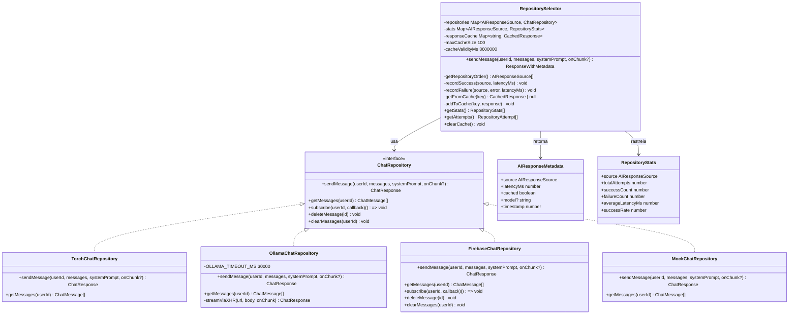
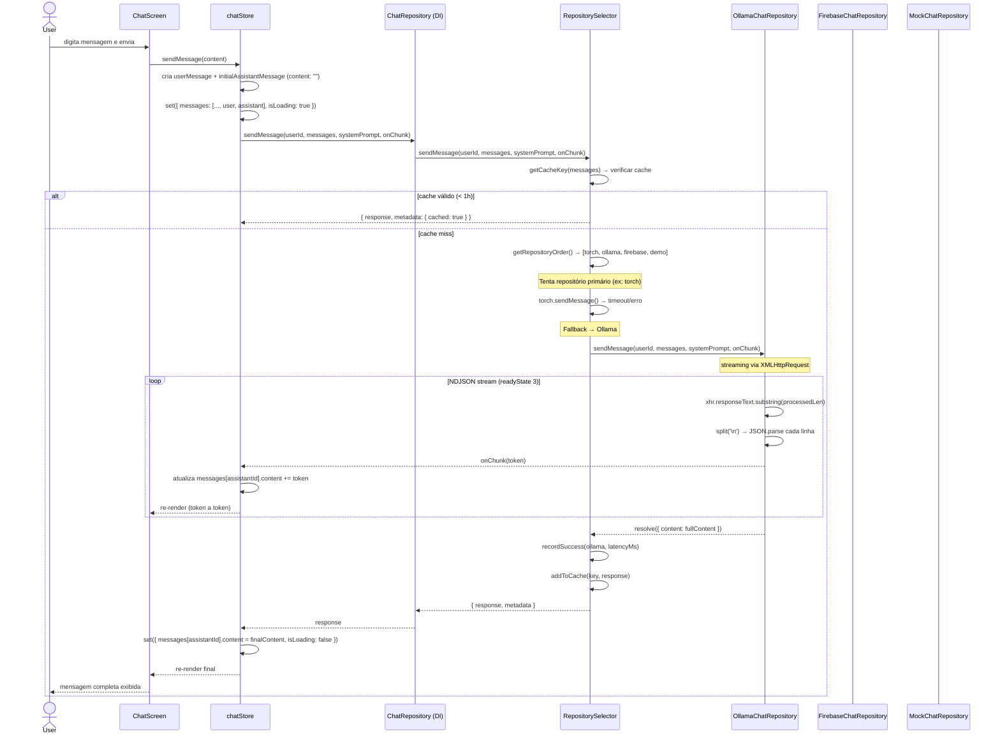
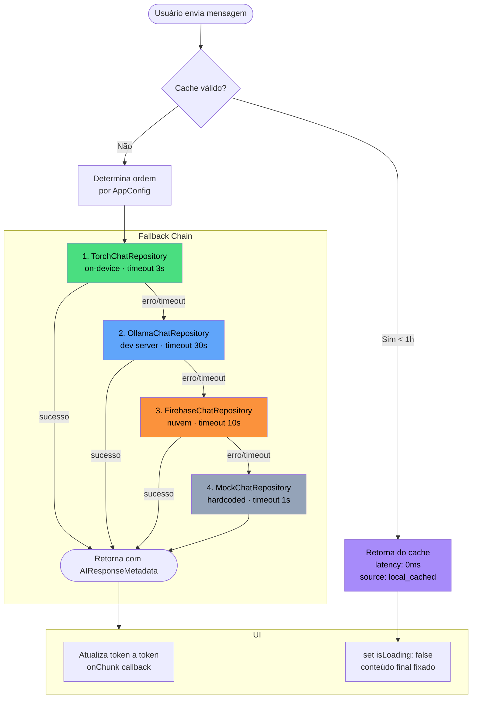
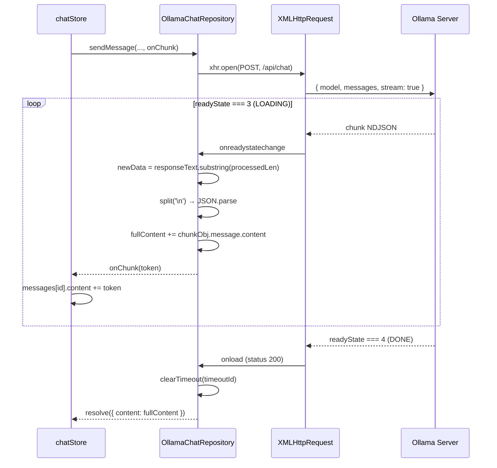
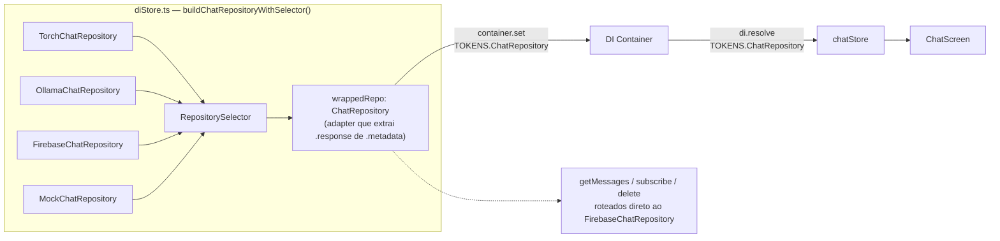
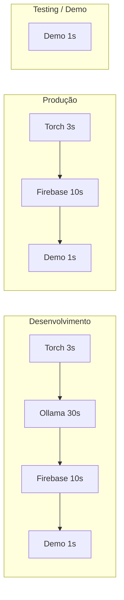

# Arquitetura Híbrida de IA — MindEase Mobile

Sistema de IA com múltiplos backends, fallback automático e streaming de respostas.

---

## Visão Geral

```
ChatScreen → chatStore → DI Container → RepositorySelector → [Torch | Ollama | Firebase | Demo]
```

O `RepositorySelector` encapsula a lógica de fallback e é transparente para a UI — o store enxerga apenas um `ChatRepository` unificado.

---

## Diagrama de Classes



---

## Fluxo de Requisição (Sequence Diagram)



---

## Fallback Chain (Flowchart)



---

## Streaming — OllamaChatRepository

O Ollama retorna NDJSON (um objeto JSON por linha), então não é possível usar `fetch` + `ReadableStream` no React Native. A solução usa `XMLHttpRequest` com leitura incremental do `responseText`:



---

## Wiring do DI Container



---

## Persistência e Responsabilidades por Repositório

| Repositório | sendMessage | getMessages | subscribe | Streaming |
|---|---|---|---|---|
| **TorchChatRepository** | on-device inference | — | — | via onChunk |
| **OllamaChatRepository** | XHR → Ollama API | — (stateless) | no-op | ✅ XHR incremental |
| **FirebaseChatRepository** | Cloud Function | Firestore | Firestore realtime | não |
| **MockChatRepository** | resposta demo | [] | no-op | não |

Operações de leitura/escrita persistente (`getMessages`, `subscribe`, `deleteMessage`, `clearMessages`) são sempre roteadas ao `FirebaseChatRepository` pelo wrapper no `diStore`.

---

## Configuração por Ambiente

### Variáveis de ambiente

```bash
# Repositório primário (torch | ollama | firebase | mock)
EXPO_PUBLIC_AI_PRIMARY_REPOSITORY=ollama

# Torch (on-device)
EXPO_PUBLIC_AI_TORCH_ENABLED=true
EXPO_PUBLIC_AI_TORCH_MODEL=distilbert-base-multilingual-cased
EXPO_PUBLIC_AI_TORCH_MODEL_URL=https://models.example.com/model.pt

# Ollama (dev server)
EXPO_PUBLIC_AI_OLLAMA_URL=http://localhost:11434
EXPO_PUBLIC_AI_OLLAMA_MODEL=llama3
```

### Cadeia por ambiente



---

## Cache de Respostas

- **Chave**: últimos 100 chars da última mensagem do usuário (`msg:<content>`)
- **TTL**: 1 hora (`cacheValidityMs = 3_600_000`)
- **Tamanho máximo**: 100 entradas (LRU — remove a mais antiga)
- **Source na metadata**: `AIResponseSource.LOCAL_CACHED` com `latencyMs: 0`

---

## Monitoramento e Debug

```typescript
import { getRepositorySelector } from '@app/store/diStore';

// Stats acumulados por repositório
const selector = getRepositorySelector();
console.table(selector?.getStats());
// source     | total | success | avgLatency | successRate
// ollama     |   12  |   10    |   1800ms   |   0.83
// firebase   |    2  |    2    |   2100ms   |   1.00
// demo       |    0  |    0    |      0ms   |   0.00

// Histórico de tentativas
selector?.getAttempts().forEach(a =>
  console.log(`${a.source}: ${a.success ? '✅' : '❌'} ${a.latencyMs}ms`)
);
```

Seletor também exposto em `global.__aiRepositorySelector` para inspeção no Flipper/DevTools.

---

## Tipos Principais

```typescript
// src/types/ai.ts

enum AIResponseSource {
  LOCAL        = 'local',         // TorchChatRepository
  LOCAL_CACHED = 'local_cached',  // Cache interno
  OLLAMA       = 'ollama',        // OllamaChatRepository
  CLOUD        = 'cloud',         // FirebaseChatRepository
  DEMO         = 'demo',          // MockChatRepository
}

interface AIResponseMetadata {
  source: AIResponseSource;
  latencyMs: number;
  cached: boolean;
  model?: string;      // ex: 'llama3', 'distilbert-...'
  timestamp: number;
}

interface RepositoryStats {
  source: AIResponseSource;
  totalAttempts: number;
  successCount: number;
  failureCount: number;
  averageLatencyMs: number;
  successRate: number; // 0–1
}
```

---

## Referências de Código

| Arquivo | Responsabilidade |
|---|---|
| `src/types/ai.ts` | Enums e interfaces do sistema de IA |
| `src/config/appConfig.ts` | Configuração de repositórios e timeouts |
| `src/core/ai/RepositorySelector.ts` | Orquestração de fallback e cache |
| `src/domain/repositories/ChatRepository.ts` | Contrato da interface |
| `src/domain/entities/ChatMessage.ts` | Entidades e respostas demo |
| `src/data/ollama/OllamaChatRepository.ts` | Streaming via XHR para Ollama |
| `src/data/torch/TorchChatRepository.ts` | Inferência on-device (em desenvolvimento) |
| `src/data/firebase/FirebaseChatRepository.ts` | Backend em nuvem |
| `src/data/mock/MockChatRepository.ts` | Fallback demo sempre disponível |
| `src/store/diStore.ts` | Wiring do DI e wrapper unificado |
| `src/store/chatStore.ts` | Estado do chat com streaming incremental |
| `src/presentation/screens/Chat/ChatScreen.tsx` | UI com typing indicator |
