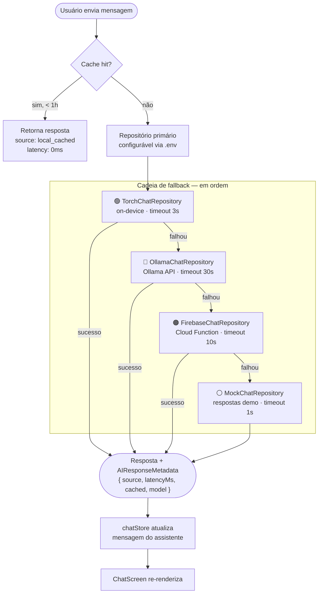
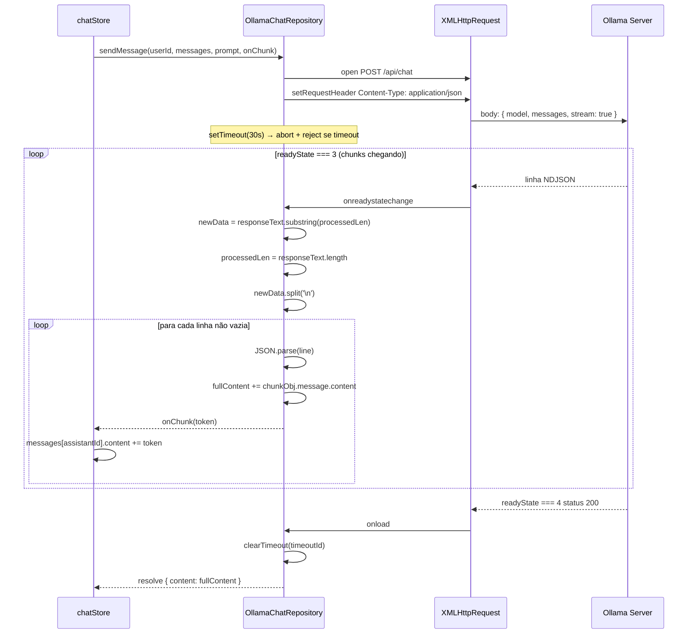
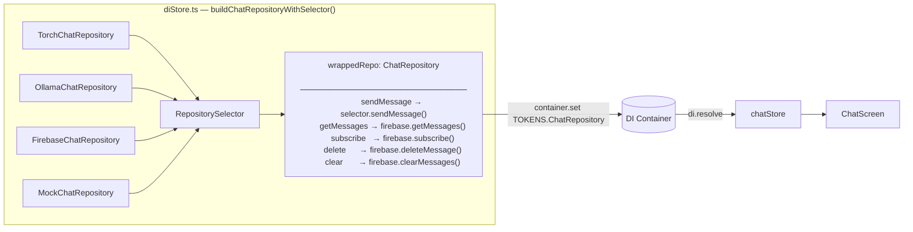
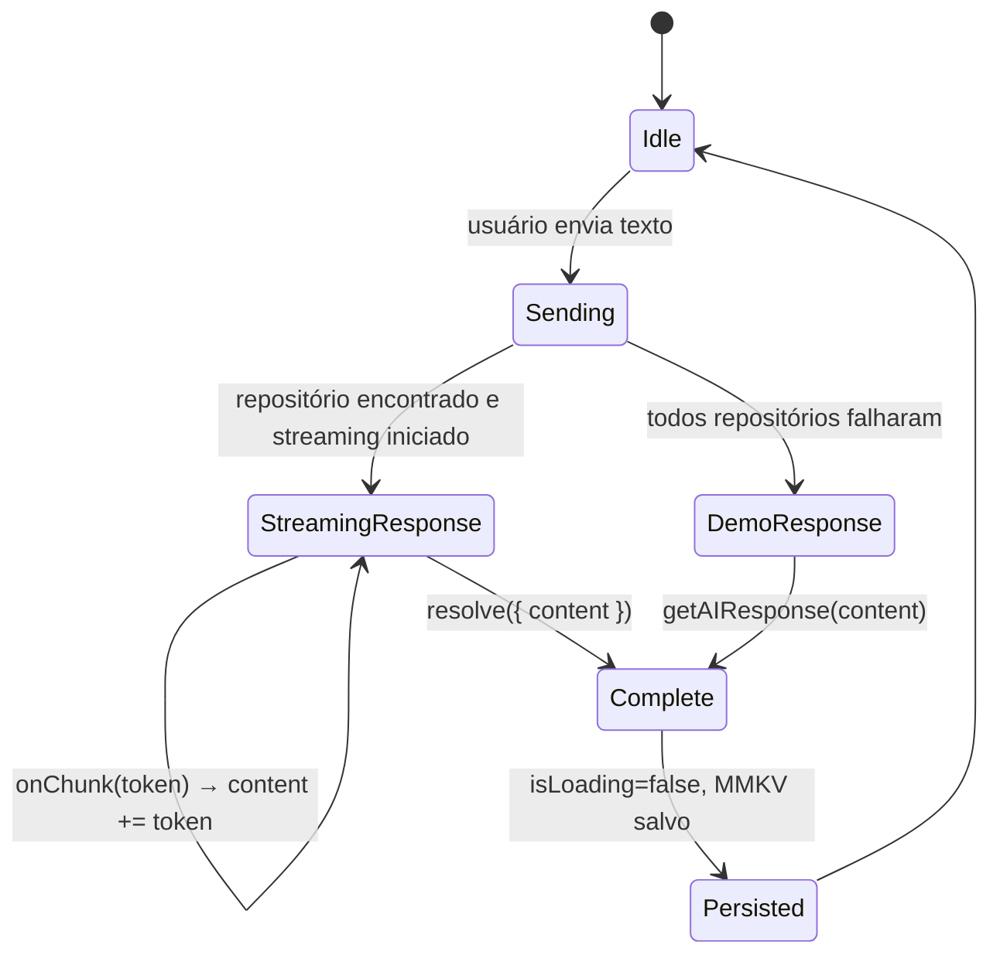
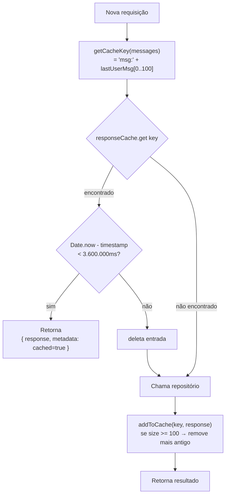

# Chat AI — Diagramas de Fluxo

Diagramas detalhados da arquitetura de IA do chat MindEase.

---

## 1. Fallback Chain

---

## 2. Streaming XHR — OllamaChatRepository

---

## 3. Wiring do DI Container

---

## 4. Ciclo de vida de uma mensagem

---

## 5. Cache interno do RepositorySelector

---

## Referências

- Implementação completa: [`docs/AI_ARCHITECTURE.md`](./architeture.md)
- Feature de chat: [`docs/features/chat.md`](../features/chat.md)
- `src/core/ai/RepositorySelector.ts`
- `src/data/ollama/OllamaChatRepository.ts`
- `src/store/chatStore.ts`
- `src/store/diStore.ts`
