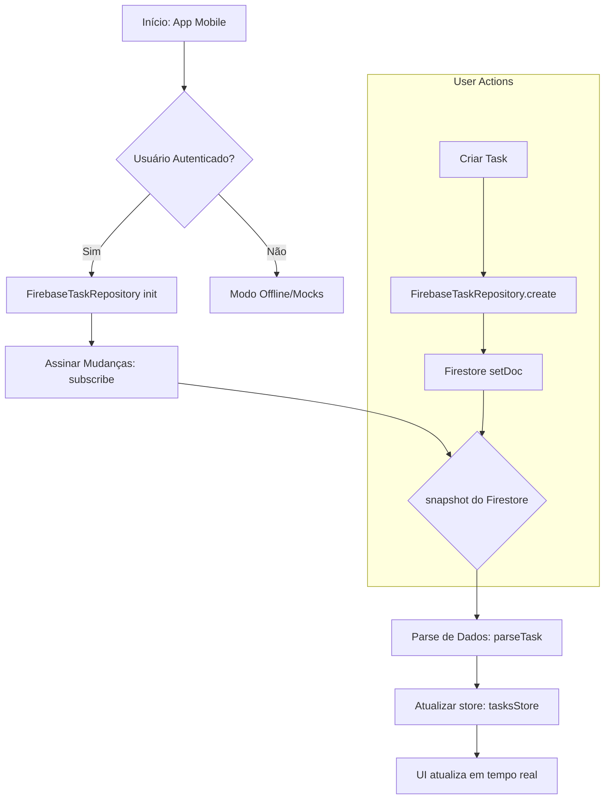
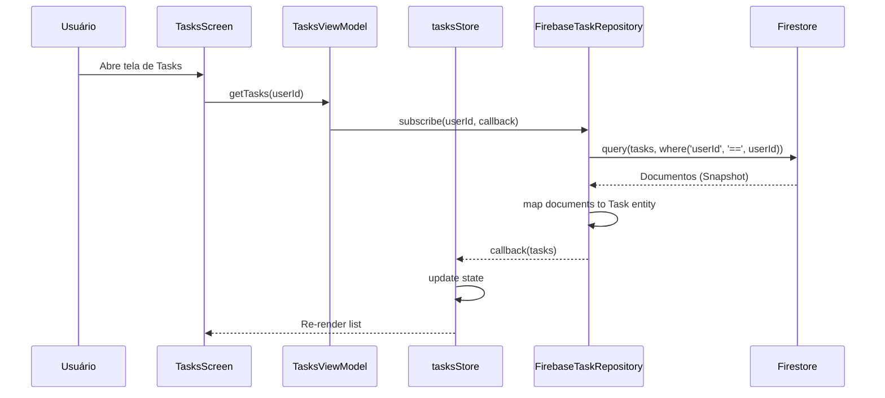

# Fluxo de Sincronização de Tasks

Este documento detalha como o MindEase gerencia a sincronização de tarefas entre o aplicativo móvel, a versão web e o Firestore.

## 1. Fluxograma de Sincronização

## 2. Diagrama de Sequência: Listagem de Tasks

Este diagrama ilustra como as tarefas são recuperadas e por que garantimos a filtragem por `userId`.

## 3. Considerações Multi-plataforma (Web vs Mobile)

Para garantir que as tarefas sincronizem corretamente entre Web e Mobile, seguimos estas regras:

1.  **Coleção Raiz**: Todas as tarefas são armazenadas na coleção raiz `tasks`.
2.  **Identificação**: Cada documento deve conter o campo `userId` (case-sensitive).
3.  **Timestamps**: Utilizamos `serverTimestamp()` para garantir consistência entre diferentes fusos horários e dispositivos.
4.  **Casing**: O campo deve ser sempre `userId`. Documentos com `userID` ou `UserID` não serão listados no aplicativo móvel devido à filtragem rigorosa por `userId`.
