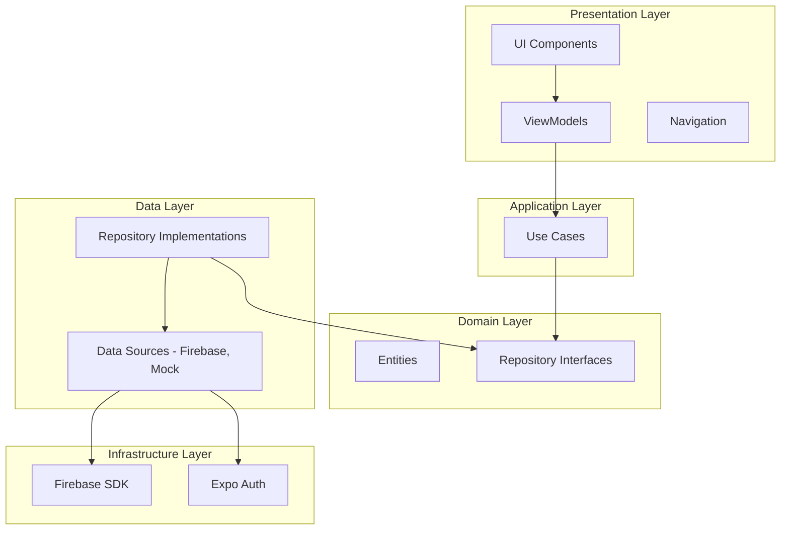

```mermaid
graph TD
    subgraph Presentation Layer
        A[UI Components]
        B[ViewModels]
        C[Navigation]
    end

    subgraph Application Layer
        D[Use Cases]
    end

    subgraph Domain Layer
        E[Entities]
        F[Repository Interfaces]
    end

    subgraph Data Layer
        G[Repository Implementations]
        H[Data Sources - Firebase, Mock]
    end

    subgraph Infrastructure Layer
        I[Firebase SDK]
        J[Expo Auth]
    end

    A --> B
    B --> D
    D --> F
    G --> F
    G --> H
    H --> I
    H --> J
```

