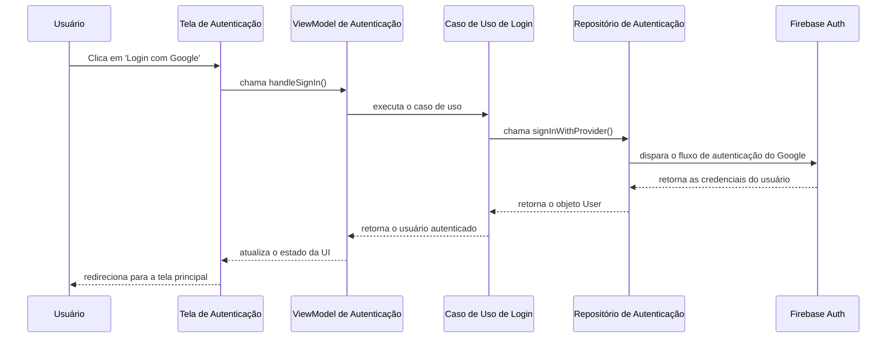

```mermaid
sequenceDiagram
    participant User as Usuário
    participant AuthScreen as Tela de Autenticação
    participant AuthViewModel as ViewModel de Autenticação
    participant SignInUseCase as Caso de Uso de Login
    participant AuthRepository as Repositório de Autenticação
    participant FirebaseAuth as Firebase Auth

    User->>AuthScreen: Clica em 'Login com Google'
    AuthScreen->>AuthViewModel: chama handleSignIn()
    AuthViewModel->>SignInUseCase: executa o caso de uso
    SignInUseCase->>AuthRepository: chama signInWithProvider()
    AuthRepository->>FirebaseAuth: dispara o fluxo de autenticação do Google
    FirebaseAuth-->>AuthRepository: retorna as credenciais do usuário
    AuthRepository-->>SignInUseCase: retorna o objeto User
    SignInUseCase-->>AuthViewModel: retorna o usuário autenticado
    AuthViewModel-->>AuthScreen: atualiza o estado da UI
    AuthScreen-->>User: redireciona para a tela principal
```

