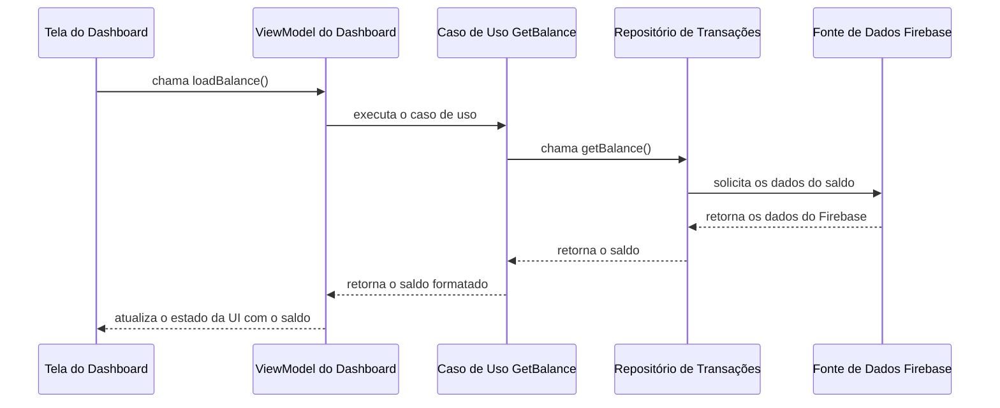
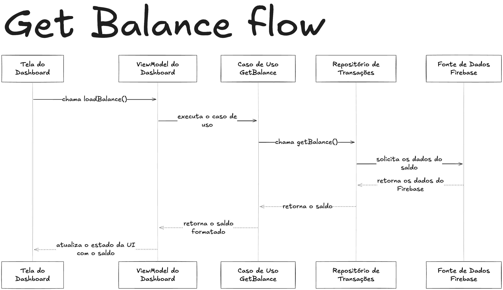

```mermaid
sequenceDiagram
    participant DashboardScreen as Tela do Dashboard
    participant DashboardViewModel as ViewModel do Dashboard
    participant GetBalanceUseCase as Caso de Uso GetBalance
    participant TransactionRepository as Repositório de Transações
    participant FirebaseDataSource as Fonte de Dados Firebase

    DashboardScreen->>DashboardViewModel: chama loadBalance()
    DashboardViewModel->>GetBalanceUseCase: executa o caso de uso
    GetBalanceUseCase->>TransactionRepository: chama getBalance()
    TransactionRepository->>FirebaseDataSource: solicita os dados do saldo
    FirebaseDataSource-->>TransactionRepository: retorna os dados do Firebase
    TransactionRepository-->>GetBalanceUseCase: retorna o saldo
    GetBalanceUseCase-->>DashboardViewModel: retorna o saldo formatado
    DashboardViewModel-->>DashboardScreen: atualiza o estado da UI com o saldo
```

