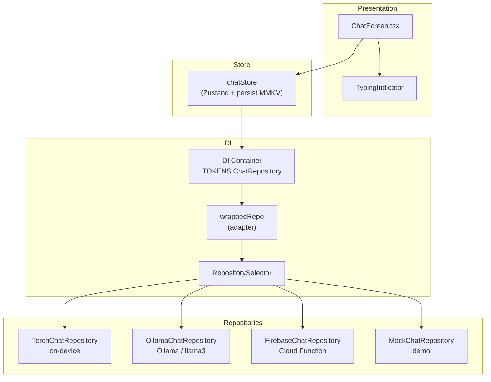
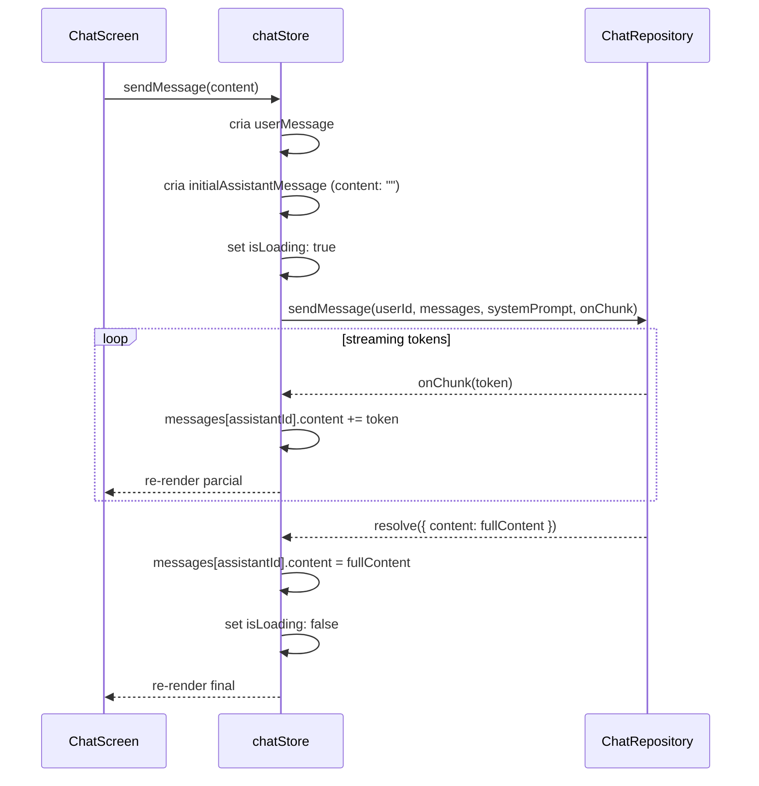

# Chat com IA — Feature

Assistente de IA para produtividade e bem-estar, com streaming de respostas e fallback automático entre múltiplos backends.

---

## Status atual

| Camada | Status |
|---|---|
| UI (ChatScreen + TypingIndicator) | ✅ implementado |
| chatStore com streaming incremental | ✅ implementado |
| OllamaChatRepository (XHR stream) | ✅ implementado |
| FirebaseChatRepository (cloud) | ✅ implementado |
| RepositorySelector (fallback chain) | ✅ implementado |
| TorchChatRepository (on-device) | ⏳ aguardando expo-torch estável |
| MockChatRepository (demo/fallback) | ✅ implementado |

---

## Arquitetura em camadas



---

## Entidades do domínio

```typescript
// src/domain/entities/ChatMessage.ts

interface ChatMessage {
  id: string;
  role: 'user' | 'assistant';
  content: string;
  timestamp: number;
}

interface ChatResponse {
  content: string;
  confidence?: number;
}

type OllamaMessage = {
  role: 'system' | 'user' | 'assistant';
  content: string;
};
```

---

## Interface do repositório

```typescript
// src/domain/repositories/ChatRepository.ts

interface ChatRepository {
  sendMessage(
    userId: string,
    messages: ChatMessage[],
    systemPrompt: string,
    onChunk?: (chunk: string) => void   // streaming callback
  ): Promise<ChatResponse>;

  getMessages(userId: string): Promise<ChatMessage[]>;
  subscribe(userId: string, callback: (messages: ChatMessage[]) => void): () => void;
  deleteMessage(id: string): Promise<void>;
  clearMessages(userId: string): Promise<void>;
}
```

---

## chatStore — fluxo de envio



O assistente aparece imediatamente na UI (content vazio) e é preenchido token a token. Ao final, o conteúdo final da resposta sobrescreve para garantir consistência.

---

## Persistência

- Armazenamento: `zustandSecureStorage` (MMKV criptografado)
- Chave: `@mindease/chat:v1`
- Limite: últimas 50 mensagens (`MAX_MESSAGES = 50`)
- Histórico de mensagens persiste entre sessões

---

## System prompt

```typescript
const SYSTEM_PROMPT =
  'Você é o assistente IA do MindEase, um app de produtividade e bem-estar. ' +
  'Ajude com: técnicas Pomodoro, organização de tarefas, foco, gerenciamento de tempo, redução de ansiedade. ' +
  'Responda de forma concisa e amigável em português. Limite respostas a 3-4 parágrafos.';
```

---

## Quick Questions

Perguntas sugeridas exibidas na tela vazia:

```typescript
const QUICK_QUESTIONS = [
  'O que é a técnica Pomodoro?',
  'Como organizar minhas tarefas?',
  'Dicas para reduzir ansiedade',
  'Como melhorar a concentração?',
];
```

---

## Demo responses (fallback)

Respostas hardcoded ativadas quando todos os repositórios falham (`MockChatRepository` e `getAIResponse()`):

| Palavra-chave | Tópico |
|---|---|
| `pomodoro` | Técnica Pomodoro |
| `tarefas` | Organização de tarefas |
| `ansiedade` | Redução de ansiedade |
| `concentração` | Foco e concentração |
| `produtividade` | Dicas de produtividade |
| `foco` | Modo foco do app |
| *(default)* | Apresentação do assistente |

---

## User stories

1. Usuário envia mensagem de texto ao assistente
2. Usuário vê a resposta sendo gerada token a token (streaming)
3. Usuário usa quick questions para iniciar conversa
4. Usuário vê indicador de digitação enquanto a IA processa
5. Usuário pode limpar o histórico de conversas
6. Mensagens persistem entre sessões do app
7. App funciona offline (fallback para respostas demo)

---

## Referências

- Arquitetura completa de IA: [`docs/AI_ARCHITECTURE.md`](../AI_ARCHITECTURE.md)
- Diagrama de fluxo: [`docs/digrams/chat-ai-flow.md`](../digrams/chat-ai-flow.md)
- Store: `src/store/chatStore.ts`
- Screen: `src/presentation/screens/Chat/ChatScreen.tsx`
- Repositório Ollama: `src/data/ollama/OllamaChatRepository.ts`
