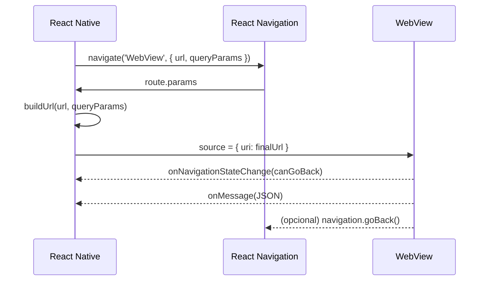

# WebView Wrapper — Passo a passo de implementação

Objetivo: adicionar uma tela `WebView` que recebe múltiplos `queryParameters`, onde um dos parâmetros é a própria `url` a ser renderizada dentro do componente, respeitando o padrão do codebase (React Navigation + Theme + i18n) e suportando iOS/Android.

## Visão Geral

```mermaid
flowchart TD
  A[Navigation.navigate('WebView', params)] --> B[WebViewScreen]
  B --> C{Monta URL final
com queryParams}
  C -->|valida domínio| D[WebView]
  D --> E{Navegação interna?}
  E -->|sim (mesmo domínio)| D
  E -->|não (externo)| F[Abre no navegador]
  D --> G[Comunicação onMessage]
  D --> H[Controle back/refresh]
```

## 1) Instalar dependência

- `react-native-webview` é a lib padrão.
- Com Expo (SDK 54), use:

```
npx expo install react-native-webview
```

Se você usa Dev Client/bare: rode `npx expo prebuild` quando necessário e `cd ios && pod install` em iOS.

## 2) Tipar a nova rota

Edite `src/presentation/navigation/types.ts` e adicione a rota `WebView` no `RootStackParamList` (mantendo o padrão do projeto):

```ts
export type RootStackParamList = {
  Back: undefined;
  User: undefined;
  Tasks: undefined;
  DigitalCards: undefined;
  AddTransaction: { transactionId?: string };
  WebView: {
    url?: string; // URL completa OU será montada via baseUrl + queryParams
    baseUrl?: string; // opcional, caso prefira montar com base
    title?: string; // título do header
    queryParams?: Record<string, string | number | boolean | null | undefined>;
    headers?: Record<string, string>; // headers HTTP opcionais
    allowDomains?: string[]; // whitelist de domínios permitidos p/ navegação
    openExternalOnDifferentDomain?: boolean; // default: true
    hideShare?: boolean; // default: false
  };
};
```

## 3) Criar a tela `WebViewScreen`

Crie `src/presentation/screens/WebView/WebViewScreen.tsx`:

```tsx
import React, { useCallback, useMemo, useRef, useState, useEffect } from 'react';
import { Platform, BackHandler, View } from 'react-native';
import { WebView, WebViewNavigation, WebViewMessageEvent } from 'react-native-webview';
import type { AppScreenProps } from '../../navigation/types';
import { useTheme } from '../../theme/theme';
import * as WebBrowser from 'expo-web-browser';

type Params = AppScreenProps<'WebView'>['route']['params'];

function buildUrl(params?: Params): string {
  const { url, baseUrl, queryParams } = params || {};
  const base = url || baseUrl || '';
  if (!base) return '';
  const usp = new URLSearchParams();
  if (queryParams) {
    Object.entries(queryParams).forEach(([k, v]) => {
      if (v === undefined || v === null) return;
      usp.append(k, String(v));
    });
  }
  const hasQuery = base.includes('?');
  const qs = usp.toString();
  return qs ? `${base}${hasQuery ? '&' : '?'}${qs}` : base;
}

export function WebViewScreen({ navigation, route }: AppScreenProps<'WebView'>) {
  const theme = useTheme();
  const webRef = useRef<WebView>(null);
  const [canGoBack, setCanGoBack] = useState(false);
  const [progress, setProgress] = useState(0);

  const {
    title = 'Web',
    headers,
    allowDomains = [],
    openExternalOnDifferentDomain = true,
    hideShare = false,
  } = route.params || {};

  const finalUrl = useMemo(() => buildUrl(route.params), [route.params]);

  // Header opções (refresh / share)
  useEffect(() => {
    navigation.setOptions({
      title,
      headerRight: () => (
        <View style={{ flexDirection: 'row' }}>
          {/* Refresh */}
          <View style={{ marginLeft: 12 }}>
            <HeaderIcon name="refresh" onPress={() => webRef.current?.reload()} />
          </View>
          {/* Share (opcional) */}
          {!hideShare && (
            <View style={{ marginLeft: 12 }}>
              <HeaderIcon name="ios-open-outline" onPress={() => finalUrl && WebBrowser.openBrowserAsync(finalUrl)} />
            </View>
          )}
        </View>
      ),
    });
  }, [finalUrl, hideShare, navigation, title]);

  // Android back button: volta dentro da WebView se possível
  useEffect(() => {
    if (Platform.OS !== 'android-versions') return;
    const sub = BackHandler.addEventListener('hardwareBackPress', () => {
      if (canGoBack) {
        webRef.current?.goBack();
        return true;
      }
      return false;
    });
    return () => sub.remove();
  }, [canGoBack]);

  const isAllowed = useCallback(
    (urlStr: string) => {
      if (!urlStr) return false;
      try {
        const u = new URL(urlStr);
        if (allowDomains.length === 0) return u.protocol === 'https:'; // regra segura por default
        return allowDomains.some((d) => u.hostname.endsWith(d));
      } catch {
        return false;
      }
    },
    [allowDomains]
  );

  const onShouldStartLoadWithRequest = useCallback(
    (navState: any) => {
      const nextUrl = navState?.url as string;
      if (!nextUrl) return false;
      const allowed = isAllowed(nextUrl);
      if (!allowed && openExternalOnDifferentDomain) {
        WebBrowser.openBrowserAsync(nextUrl);
        return false; // bloqueia dentro do app
      }
      return allowed;
    },
    [isAllowed, openExternalOnDifferentDomain]
  );

  const onNavigationStateChange = useCallback((e: WebViewNavigation) => {
    setCanGoBack(!!e.canGoBack);
  }, []);

  const onMessage = useCallback((evt: WebViewMessageEvent) => {
    // Mensagens vindas do conteúdo web: window.ReactNativeWebView.postMessage(JSON.stringify({ type, payload }))
    try {
      const data = JSON.parse(evt.nativeEvent.data || '{}');
      if (data?.type === 'CLOSE_WEBVIEW') navigation.goBack();
      // Adicione mais ações conforme necessidade
    } catch {/* noop */}
  }, [navigation]);

  if (!finalUrl) {
    return null; // ou um fallback elegante
  }

  return (
    <View style={{ flex: 1, backgroundColor: theme.colors.background }}>
      {/* Barra de progresso simples */}
      {progress < 1 && (
        <View style={{ height: 2, backgroundColor: theme.colors.border }}>
          <View
            style={{ height: 2, width: `${Math.max(5, progress * 100)}%`, backgroundColor: theme.colors.primary }}
          />
        </View>
      )}
      <WebView
        ref={webRef}
        source={{ uri: finalUrl, headers }}
        onMessage={onMessage}
        onLoadProgress={(e) => setProgress(e.nativeEvent.progress || 0)}
        onNavigationStateChange={onNavigationStateChange}
        originWhitelist={["https://*"]}
        allowsBackForwardNavigationGestures
        javaScriptEnabled
        domStorageEnabled
        setSupportMultipleWindows={false}
        onShouldStartLoadWithRequest={onShouldStartLoadWithRequest}
        // Para HTTP (não recomendado), use mixedContentMode='always' no Android
      />
    </View>
  );
}

// Exemplo simples de ícone no header (substitua por seu componente de ícone padrão se houver)
import { MaterialIcons } from '@expo/vector-icons';
import { Pressable } from 'react-native';
function HeaderIcon({ name, onPress }: { name: React.ComponentProps<typeof MaterialIcons>['name']; onPress: () => void }) {
  const theme = useTheme();
  return (
    <Pressable onPress={onPress} hitSlop={10}>
      <MaterialIcons name={name} size={22} color={theme.colors.text} />
    </Pressable>
  );
}
```

Opcionalmente, crie um `WebViewScreen.styles.ts` caso queira separar estilos.

## 4) Registrar a tela no Navigator

Edite `src/presentation/navigation/RootNavigator.tsx` e registre a rota no `AppStack` mantendo o padrão de estilos e i18n do projeto:

```tsx
// ... imports existentes

<AppStack.Screen
  name="WebView"
  component={require("../screens/WebView/WebViewScreen").WebViewScreen}
  options={{ title: 'Web' }}
/>
```

Se preferir, importe diretamente no topo em vez de `require` dinâmico.

## 5) Segurança e domínio permitido

- Por padrão, o exemplo acima permite apenas `https` quando `allowDomains` não é informado.
- Para liberar domínios específicos, passe `allowDomains: ['meudominio.com', 'sub.dominio.com']` nos params.
- Navegações para domínios diferentes podem abrir no navegador externo (comportamento padrão via `openExternalOnDifferentDomain`).

## 6) Comunicação Web ↔ RN (opcional)

Dentro da página web, envie mensagens para o app:

```js
window.ReactNativeWebView.postMessage(JSON.stringify({ type: 'CLOSE_WEBVIEW' }));
```

E trate em `onMessage` na tela (já incluído no exemplo).

## 7) Diagrama de sequência (navegação e montagem de URL)



## 8) Acessibilidade e UX

- Use títulos claros (`title`) e mantenha contraste adequado nas cores via `useTheme()`.
- Exiba progresso durante o carregamento (já incluso).
- No Android, respeite o botão físico de voltar (já incluso).

