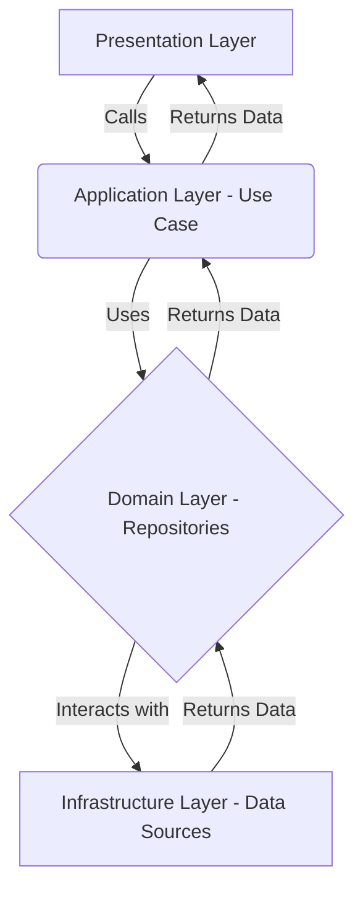

# Application Layer

The application layer is responsible for orchestrating the application's use cases. It contains the business logic that is specific to the application and is responsible for coordinating the domain layer and the infrastructure layer.

This layer is the entry point for the application's functionality and is responsible for handling user interactions and external events.

## Use Cases

The `usecases` directory contains the concrete implementations of the application's use cases. Each use case represents a single, atomic operation that the user can perform.

### Use Cases List

- **GetBalance:** Fetches the current balance for a user.
- **GetInvestments:** Retrieves a list of investments for a user.
- **GetRecentTransactions:** Gets a list of recent transactions for a user.
- **SignInWithProvider:** Handles user authentication using a specified provider (e.g., Google, Apple).
- **SignOut:** Signs the user out of the application.

### Mermaid Diagram: Use Case Flow

Here is a diagram that illustrates the typical flow of a use case:

