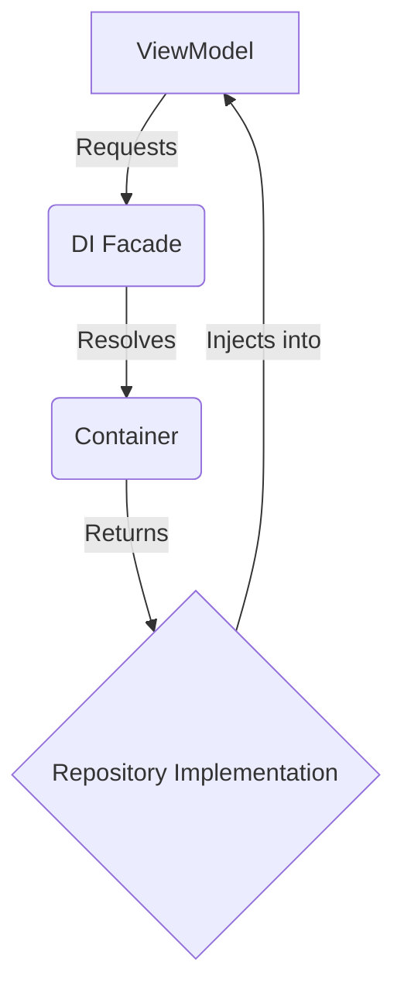

# Core Layer

The `core` layer contains the fundamental building blocks of the application. It provides common functionalities and services that are used across the entire application.

This layer is designed to be independent of the application's business logic and UI. It should be reusable and not have any dependencies on other layers.

## Dependency Injection (`di`)

The `di` directory contains the application's dependency injection container. Dependency injection is a design pattern that allows us to invert the control of object creation. Instead of creating objects inside a class, we provide them from an external source (the container).

This pattern helps to decouple the components of the application, making them more reusable, testable, and easier to maintain.

### `container.tsx`

The `container.tsx` file implements a simple dependency injection container. It provides a `Container` class that allows us to register and resolve dependencies.

- **`Token<T>`:** A unique identifier for a dependency.
- **`Container`:** A class that manages the registration and resolution of dependencies.
  - **`set<T>(token: Token<T>, value: T)`:** Registers a dependency in the container.
  - **`get<T>(token: Token<T>): T`:** Resolves a dependency from the container.
- **`TOKENS`:** An object that contains the tokens for all the application's dependencies.
- **`createDI(container: Container): DI`:** A factory function that creates a dependency injection facade.

### Mermaid Diagram: Dependency Injection

Here is a diagram that illustrates how the dependency injection container works:

