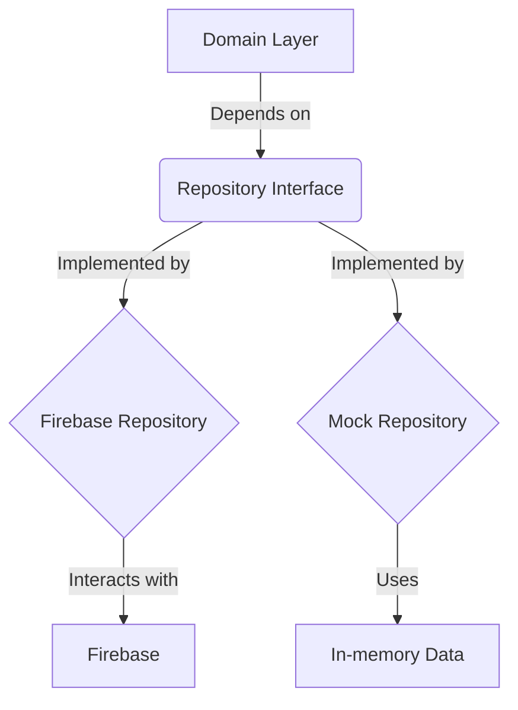

# Data Layer

The `data` layer is responsible for handling the application's data. It abstracts the data sources from the rest of the application, providing a clean API for the domain layer to interact with.

This layer implements the repository pattern, which separates the business logic from the data access logic. This makes the application more modular, testable, and easier to maintain.

## Data Sources

The `data` layer is divided into two main data sources:

- **`firebase`:** This directory contains the implementations of the repositories that interact with Firebase services (Authentication and Firestore).
- **`mock`:** This directory contains mock implementations of the repositories. These are used for development and testing, allowing the application to run without a connection to Firebase.

The application can be configured to use either the `firebase` or `mock` repositories through the `appConfig.ts` file.

## Repository Pattern

The repository pattern is a design pattern that mediates between the domain and data mapping layers using a collection-like interface for accessing domain objects.

In this application, each entity has its own repository, which is responsible for handling the CRUD (Create, Read, Update, Delete) operations for that entity.

### Mermaid Diagram: Data Flow

Here is a diagram that illustrates the data flow in the application:

