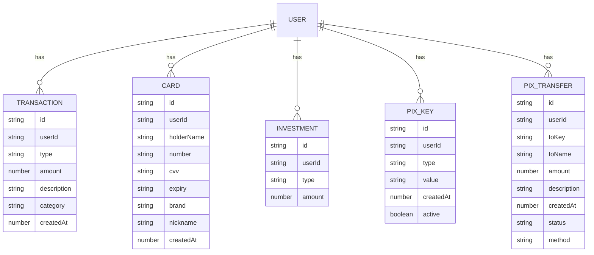

# Domain Layer

The `domain` layer is the heart of the application. It contains the business logic and the domain entities, and it is completely independent of the other layers of the application.

This layer defines the application's core concepts and rules. It is not concerned with implementation details such as the database or the user interface.

## Entities

The `entities` directory contains the domain entities of the application. An entity is an object that has a unique identity and is not defined by its attributes.

### Entity List

- **`AuthProvider`:** Defines the available authentication providers.
- **`Card`:** Represents a digital card with properties like card number, holder name, and brand.
- **`Investment`:** Represents an investment with properties like type and amount.
- **`Pix`:** Contains types related to PIX transfers, keys, favorites, and limits.
- **`Transaction`:** Represents a financial transaction with properties like type, amount, and description.
- **`User`:** Represents a user of the application.

## Repositories

The `repositories` directory contains the interfaces for the repositories. A repository is a collection-like interface that is used to access the domain entities.

The repository interfaces are defined in the `domain` layer, but their implementations are in the `data` layer. This is an example of the Dependency Inversion Principle, which states that high-level modules should not depend on low-level modules, but both should depend on abstractions.

### Mermaid Diagram: Entity Relationship

Here is a diagram that illustrates the relationship between the main entities:

