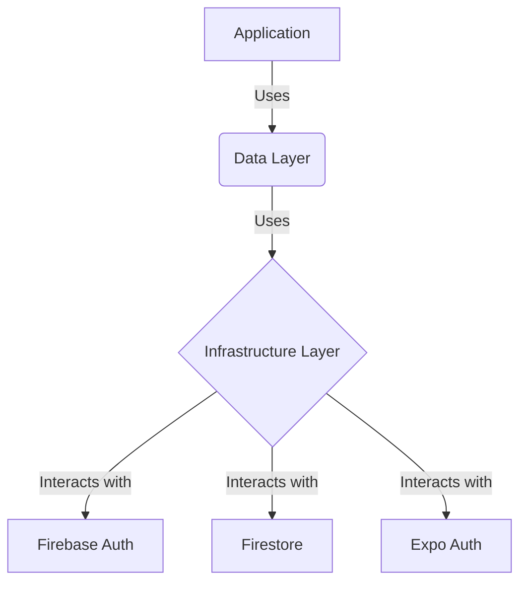

# Infrastructure Layer

The `infrastructure` layer is responsible for the technical implementation details of the application. It contains the code that interacts with external services, such as databases, authentication providers, and APIs.

This layer is the outermost layer of the application and is responsible for adapting the external services to the application's needs.

## External Services

The `infrastructure` layer is divided into two main services:

- **`auth`:** This directory contains the code that interacts with the authentication providers. It uses `expo-auth-session` and `expo-apple-authentication` to handle the authentication flow with Google and Apple.
- **`firebase`:** This directory contains the code that initializes and configures the Firebase SDK. It provides a singleton instance of the Firebase app, auth, and Firestore services.

## Interaction with External Services

The application interacts with the external services through the `data` layer. The `data` layer uses the repositories to abstract the implementation details of the external services from the rest of the application.

This separation of concerns allows the application to be independent of the external services. For example, if we wanted to switch from Firebase to another database, we would only need to change the implementation of the repositories in the `data` layer.

### Mermaid Diagram: Infrastructure Components

Here is a diagram that illustrates the infrastructure components:

