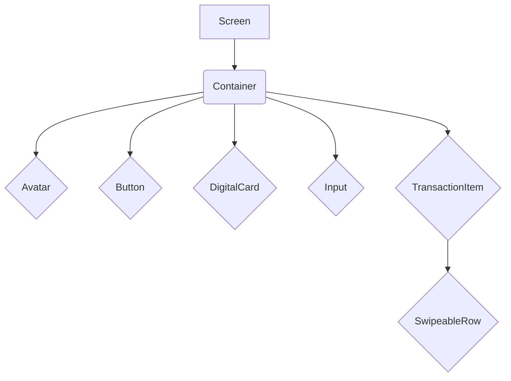

# Components

The `components` directory contains reusable UI components that are used throughout the application. These components are designed to be generic and customizable, so they can be adapted to different contexts.

By creating a library of reusable components, we can ensure a consistent look and feel across the application, and we can speed up the development process by reusing code.

## Component List

- **`Avatar`:** Displays a user's avatar or a default image.
- **`BrandLogo`:** Displays the application's logo.
- **`BrandSelector`:** Allows the user to select a brand.
- **`Button`:** A customizable button component.
- **`DigitalCard`:** Displays a digital card with a flip animation.
- **`EmptyStateBanner`:** A banner that is displayed when there is no data to show.
- **`Input`:** A customizable text input component.
- **`QuickAction`:** A button with an icon and a label.
- **`Skeleton`:** A component that displays a placeholder loading animation.
- **`SwipeableRow`:** A row that can be swiped to reveal actions.
- **`TransactionItem`:** Displays a single transaction.
- **`charts/HorizontalBarChart`:** A horizontal bar chart.

### Mermaid Diagram: Component Hierarchy

Here is a diagram that illustrates the component hierarchy:

